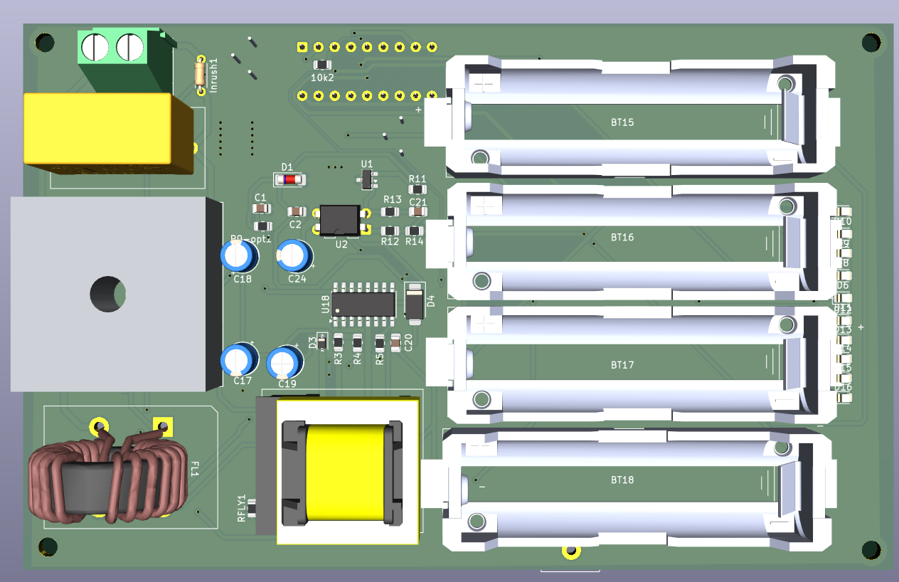

# BMS  4S Li-Ion Battery Management System



> Custom BMS PCB designed in KiCad for a 4S Li-Ion battery pack — integrates cell protection, passive balancing, isolated AC/DC charging, and LED battery indication on a single board.

---

## Features

- **4S Li-Ion protection** via BQ77905 - OVP, UVP, OCD, SCD, OT/UT per cell
- **Passive cell balancing** (VC1–VC5)
- **Isolated flyback AC/DC charger** - VIPer26LD + PC817 + TL431 feedback
- **10-segment LED battery indicator** - LM3914
- **AC EMI filter** - X+Y capacitors, varistor surge protection
- **Temperature monitoring** - NTC thermistor on TS pin

---

## Specifications

| Parameter | Value |
|---|---|
| Cell configuration | 4S Li-Ion |
| Nominal pack voltage | 14.4 V |
| Full charge voltage | 16.8 V |
| Charge current | 2 A |
| Charger input |230V(50Hz) |
| Design tool | KiCad 10 |

---

## Key Components

| Reference | Part | Function |
|---|---|---|
| U21 | BQ77905 | BMS IC - protection + balancing |
| U18 | VIPer26LD | Flyback AC/DC controller |
| U3 | LM3914 | LED battery level indicator |
| U2 | PC817 | Optocoupler - galvanic isolation |
| U1 | TL431DBZ | Voltage reference - feedback |
| T3 | Würth EE20_10_6_750811647 | Flyback transformer |
| Q22, Q23 | CSD19531Q5A | N-ch MOSFETs - charge/discharge path |
| D2 | KBPC | AC bridge rectifier |
| FL2 | P300PL104M275xC332 | AC EMI filter |
| RV01 | Varistor | Surge/overvoltage protection |
| TH2 | Thermistor | Temperature sense (TS pin) |

---

## System Architecture

```
230V(50Hz) ──► FL2 (EMI filter) ──► D2 (rectifier) ──► U18 VIPer26LD
                                                              │
                                                         T3 transformer
                                                        ╱             ╲
                                               Aux winding         Secondary
                                                    │                   │
                                               VDD (~5V)           VO (16.8V)
                                                                        │
                                                              PC817 + TL431
                                                             (isolated feedback)

4S Pack (BT15–BT18) ──► BQ77905 ──► CSD19531Q5A MOSFETs ──► PACK+ / PACK-
                              │
                          LM3914 ──► LED bar
```

## References

- [TI SLUA793 — BQ77905 Design Considerations in High-Current Applications](https://www.ti.com/lit/an/slua793/slua793.pdf)
- [DigiKey Reference Design — AC/DC SMPS Multi-Output (STEVAL-ISA081V1)](https://www.digikey.com/reference-designs/en/ac-dc-and-dc-dc-conversion/ac-dc-smps-multi-output/752)
- [EEVblog — How Does This Flyback Feedback Circuit Work?](https://www.eevblog.com/forum/projects/how-does-this-flyback-feedback-circuit-work/)
- [BQ77905 Product Page — Texas Instruments](https://www.ti.com/product/BQ77905)
- [VIPer26LD Datasheet — STMicroelectronics](https://www.st.com/en/power-management/viper26ld.html)

---
